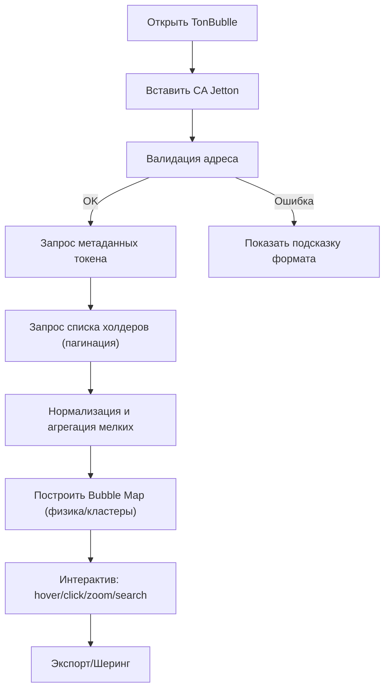

## 1. Обзор продукта
TonBublle — неоново‑красный сайт‑сканер для TON Jetton, который превращает список холдеров в интерактивную Bubble Map.
- Цель: быстро понять распределение токена по кошелькам и увидеть “кто держит пузырь”.
- Ценность: визуальная диагностика (концентрация, “киты”, кластеры), шаринг ссылки на карту, экспорт данных.

## 2. Ключевые функции

### 2.1 Роли пользователей
Ролей нет: сайт публичный, без регистрации.

### 2.2 Функциональные модули (страницы)
1. **Главная (/)**: ввод CA, пресеты TonBublle, быстрые тумблеры визуализации, загрузка Bubble Map.
2. **Карта токена (/token/:address)**: Bubble Map + панель аналитики + инструменты экспорта/шеринга.
3. **Lore & Buttons (/lore)**: “детские” тексты‑отсылки на TonBublle, мини‑панель интерактива (пасхалки), ссылки на соцсети/каналы.

### 2.3 Детализация по страницам
| Страница | Модуль | Описание функционала |
|---|---|---|
| / | Hero‑панель TonBublle | Большой заголовок, “кривые” подписи, динамические слоганы, кнопки‑шумы (вкл/выкл). |
| / | Ввод CA | Поле для Jetton master address (CA), кнопка “Надуть пузырь”, валидация, подсказки формата. |
| / | Пресеты | Кнопки: “TonBublle Demo”, “Random Jetton”, “Top‑Holders mode”, “Safe mode”. |
| / | Быстрые переключатели | Лимит холдеров, режим кластеризации (агрегация мелких), “показать биржи”, “сгладить физику”, “режим хаоса”. |
| /token/:address | Шапка токена | Название/символ/иконка (если есть), адрес, быстрые действия: копировать, открыть во внешнем обозревателе. |
| /token/:address | Bubble Map (центральная сцена) | Визуализация холдеров пузырями, масштабирование/панорамирование, hover‑подсказки, клик‑фокус, поиск кошелька. |
| /token/:address | Панель аналитики | Top‑N холдеров, суммарные проценты, индикатор концентрации (например: Top1/Top10/Top50), предупреждения. |
| /token/:address | Фильтры/слои | Скрыть “прочих”, порог минимального %, подсветка “китов”, выделение биржевых кошельков (если распознаны). |
| /token/:address | Экспорт и шаринг | Экспорт JSON (холдеры), PNG/SVG (скрин карты), копирование ссылки с параметрами, кнопка “Сохранить пресет”. |
| /token/:address | Инфо‑лента TonBublle | “детские” подсказки‑тосты, статус загрузки, мини‑лог (без тех. мусора). |
| /lore | Тексты/отсылки | Страница с тональностью “будто пишет ребенок”: короткие фразы, “наклейки”, кривые подписи. |
| /lore | Панель ссылок | Ссылки на TonBublle (соцсети/каналы), кнопка “Back to Bublle”, мини‑кнопки‑пасхалки. |

## 3. Основной сценарий
Пользователь вставляет CA токена → сайт получает метаданные токена и список холдеров → строит Bubble Map → пользователь взаимодействует (hover/click/zoom), применяет фильтры, экспортирует/шерит.

## 4. Дизайн интерфейса

### 4.1 Стиль
- Палитра: черный/угольный фон, неоново‑красные акценты, белый “мел”, дополнительный кислотный лайм только для статусов/подсветки.
- Без градиентов и без скруглений: прямые углы, жирные рамки, “скотч”‑блоки, “наклейки”.
- Типографика: заголовки “детским” шрифтом (похожим на рукописный/рисованный), цифры/адреса — моноширинный контрастный шрифт.
- Тексты: намеренно “по‑детски”, короткие фразы, повторяющиеся “TonBublle”‑отсылки.
- “Живость”: микродвижение (мигание неона, дрожание рамок, подпрыгивание кнопок), случайные мини‑детали на фоне (узоры/штампы), но без перегруза читаемости.

### 4.2 Визуальный язык Bubble Map
- Пузырь = холдер: размер пропорционален доле (или балансу), цвет = тип (обычный/биржа/контракт/прочие).
- Лейблы: появляются при hover/фокусе; в обычном состоянии — только топ‑пузырям.
- Стилизация под сайт: толстые контуры, “неоновые” обводки, прямоугольные тултипы, “детские” заголовки панелей.

### 4.3 Адаптивность
- Desktop‑first: широкая сцена Bubble Map и боковая панель.
- Mobile: панель уезжает вниз/в оверлей; сцена сохраняет zoom/pan жестами; упрощенный режим (лимит холдеров ниже).

## 5. Нефункциональные требования
- Производительность: быстрый первый рендер, прогрессивная загрузка (показывать частично, пока догружаются страницы холдеров).
- Надежность: режим без API‑ключа (ограничения по лимитам), и режим с ключом через серверный прокси.
- Безопасность: API‑ключи только на сервере, во фронт не попадают.
