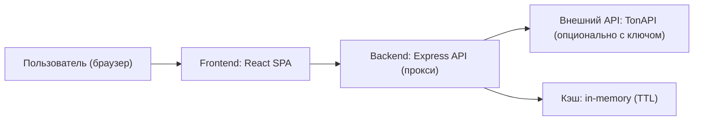

## 1. Архитектура



Ключевая идея: фронтенд не ходит напрямую во внешние сервисы. Все запросы на метаданные и холдеров идут через backend‑прокси, который:
- аккуратно прячет API‑ключи (если заданы),
- сглаживает CORS,
- добавляет базовый кэш (TTL) и лимиты,
- дает единый формат данных для Bubble Map.

## 2. Технологии
- Инициализация: Vite шаблон react-express-ts.
- Frontend: React 18 + TypeScript + react-router-dom + tailwindcss + zustand.
- Backend: Express + TypeScript (ESM).
- Визуализация Bubble Map: Canvas 2D (рендер) + force‑симуляция на клиенте (через небольшую библиотеку физики или собственную реализацию в src/utils).
- Интеграция с TON данными: TonAPI (без ключа работает, с ключом стабильнее).

## 3. Маршруты (frontend)
| Route | Назначение |
|---|---|
| / | Ввод CA, пресеты, быстрые тумблеры, переход к карте токена |
| /token/:address | Bubble Map + аналитика + экспорт/шеринг |
| /lore | Страница “TonBublle lore” с отсылками, ссылками, пасхалками |

## 4. API (backend)

### 4.1 Переменные окружения
- TONAPI_BASE_URL (по умолчанию https://tonapi.io)
- TONAPI_KEY (опционально)
- CACHE_TTL_SECONDS (например 60–300)

### 4.2 Типы данных (shared)

```ts
export type JettonAddress = string

export type JettonMeta = {
  address: JettonAddress
  name?: string
  symbol?: string
  decimals?: number
  imageUrl?: string
}

export type Holder = {
  ownerAddress: string
  balanceRaw: string
  balance: number
  share: number
  tags?: Array<"exchange" | "contract" | "unknown">
}

export type HoldersResponse = {
  jetton: JettonMeta
  holders: Holder[]
  totalHolders?: number
  source: "tonapi"
  fetchedAt: string
}
```

### 4.3 Endpoint’ы
| Method | Path | Назначение |
|---|---|---|
| GET | /api/jettons/:address/meta | Метаданные токена в нормализованном виде |
| GET | /api/jettons/:address/holders?limit=…&cursor=… | Список холдеров (пагинация/лимиты провайдера скрыты за прокси) |
| GET | /api/health | Проверка доступности сервера |

### 4.4 Поведение прокси
- Если TONAPI_KEY задан: добавлять заголовок авторизации для TonAPI.
- Если ключа нет: работать в “public mode”, возвращать понятные ошибки при лимитах.
- Кэшировать ответы по (address, limit, cursor) на TTL.
- Нормализовать формат (приводить балансы к number с учетом decimals, считать долю share).

## 5. Компоненты (frontend, целевая декомпозиция)
- src/pages/HomePage.tsx: ввод CA, пресеты, быстрые настройки.
- src/pages/TokenMapPage.tsx: сцена карты + панели/сайдбар.
- src/pages/LorePage.tsx: “TonBublle lore” и ссылки.
- src/components/BubbleMapCanvas.tsx: canvas‑рендер, zoom/pan, hover, фокус.
- src/components/TokenHeader.tsx: мета токена и действия.
- src/components/AnalyticsPanel.tsx: топ‑холдеры, метрики концентрации.
- src/components/ControlsPanel.tsx: тумблеры/слайдеры, режимы.
- src/components/ExportPanel.tsx: экспорт/шеринг.

## 6. Алгоритм Bubble Map (клиент)
- Вход: список холдеров (top‑N), “прочие” агрегируются в 1–5 пузырей (например по квантам доли).
- Радиус: r = k * sqrt(share) (стабильные визуальные различия).
- Физика: force‑layout с коллизией (без перекрытий) + слабое притяжение к центру + опциональные “кластеры” по тегам.
- Интерактив:
  - hover: тултип (прямоугольный, без скругления) с адресом/долей,
  - click: закрепить пузырь, подсветить связи/кластер, показать карточку,
  - zoom/pan: колесо/тач,
  - search: подсветить адрес/частичное совпадение.

## 7. Нефункциональные требования
- Никаких секретов во фронте.
- Обработка ошибок: понятные сообщения (“TonAPI лимит”, “Неверный CA”, “Провайдер недоступен”).
- Доступность: фокус‑состояния, клавиатурная навигация по ключевым кнопкам.
